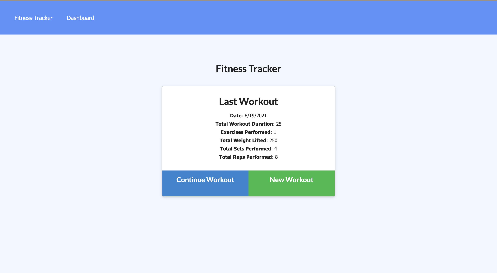
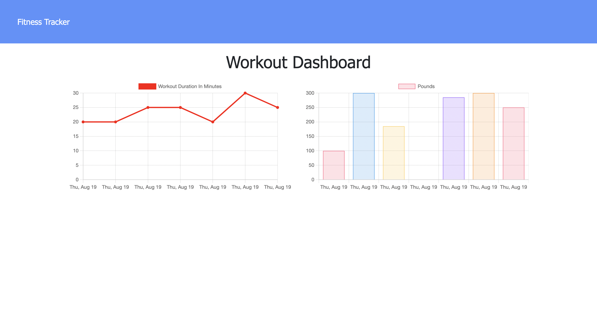

# Workout Tracker

 

## Description

This application provides a fitness tracker where users can keep track of their workouts and exercises. It provides users with a space to detail the exercises that they have performed during their recent workouts.

This application uses a Mongo database, a Mongoose schema, and Express API routes.

## Table of Contents

- [Installation](#installation)
- [Usage](#usage)
- [License](#license)
- [Credits](#credits)
- [Questions](#questions)

## Installation

To use this application, navigate to the deployed Heroku [site](https://fierce-chamber-95866.herokuapp.com/).

To install this application locally yourself, download and clone the files from this repository. Run 'npm install' to install the packages in the package.json (required packages include express, mongojs, and mongoose). You can use an application such as Compass to view the Mongo database.

The server can be started in the command-line by running 'npm start,' and the application can be viewed on your local browser at localhost.

## Usage

If you use the application through the deployed [Heroku site](https://fierce-chamber-95866.herokuapp.com/), simply navigate to and interact with the site from there. View details about your last workout, add to your previous workout, or create a new one: choosing resistance or cardio exercises for the application to track. Head to the Dashboard to see stats about the combined weight of multiple exercises or the total duration of each workout from (up to) the past seven workouts.

If the program was cloned, downloaded, and installed instead, get the application running by typing "npm start" into the command-line. All features of the application are then accessible through _localhost_ on your browser or other applications.

_Home: View Recent Workout_

_Dashboard: View Stats_

## Credits

Starter front end code provided by the University of Minnesota Coding Bootcamp.

## License

This project is licensed under [MIT License](https://opensource.org/licenses/MIT).

## Questions

See more of my work on my [GitHub Profile](https://github.com/msteblu/).
For any additional questions, reach me at my email: megan@steblay.net.
